### I build systems that prove themselves.

Full-stack engineer · CS @ Miami University ’26 · from hand-written SIMD kernels to multi-tenant Postgres

<a href="https://www.linkedin.com/in/ayush-yadav-developer">LinkedIn</a> &nbsp;·&nbsp;
<a href="mailto:aesh.03.23@gmail.com">Email</a> &nbsp;·&nbsp;
<a href="https://github.com/yadava5?tab=repositories">Repositories</a>

---

## Six systems, live

Every one is deployed, publicly reachable, and ships a **System Card** — a printed-quality walkthrough of the architecture and the evidence behind its numbers.

| | What it does | The interesting part | |
|---|---|---|---|
| **[Glyph](https://github.com/yadava5/glyph)** | Recognises handwritten digits in your browser | A neural network written **from scratch in C++**, with hand-written SIMD kernels for AVX-512 / AVX2 / NEON / wasm128, compiled to WebAssembly. **97.01%** on the held-out set. | [live](https://getglyph.vercel.app) · [system card](https://getglyph.vercel.app/system-card) |
| **[Applied](https://github.com/yadava5/applied)** | Reads your inbox and tracks your job search for you | A three-layer classifier — 201 regex rules → e5 embeddings → a fine-tuned SetFit head — behind a 0.85 confidence gate. **0.979 macro-F1**, CI-gated at 0.95. The trained model runs **in the browser** as int8 ONNX. | [live](https://getapplied.vercel.app) · [system card](https://getapplied.vercel.app/system-card) |
| **[Cadence](https://github.com/yadava5/cadence)** | Turns a plain sentence into a calendar entry | A four-stage NLP parser that shows its work, and **34 API handlers bundled into one serverless function** to live inside Vercel's 12-function cap. | [live](https://usecadenceapp.vercel.app) · [system card](https://usecadenceapp.vercel.app/system-card) |
| **[jetpack](https://github.com/yadava5/jetpack-compress)** | Compresses files in parallel, still gzip-valid | **JDK 25** virtual threads with a bounded in-flight window (peak memory independent of file size), a hand-vectorised **SIMD Adler-32** bit-identical to `java.util.zip`, and FFM memory-mapped I/O. **~6.5×** throughput. | [live](https://jetpack-compress.vercel.app) · [system card](https://jetpack-compress.vercel.app/system-card) |
| **[LifeQuest](https://github.com/yadava5/lifequest)** | Turns real-world routines into missions | Built for people rebuilding structure after a layoff — Tauri + React client, NestJS + Prisma API. | [live](https://getlifequest.vercel.app) · [system card](https://getlifequest.vercel.app/system-card) |
| **[Agentic AutoML](https://github.com/yadava5/ai-augmented-auto-ml-toolchain)** | Dataset in, deployed model out | LLM-orchestrated pipelines on LangGraph with an MCP tool registry, Docker-sandboxed Python execution, and a human approval gate at every phase. Senior Design, Miami University. | [live](https://agentic-automl-platform.vercel.app) · [system card](https://agentic-automl-platform.vercel.app/system-card) |

---

## What I actually work on

**Multi-tenant data isolation.** Defence in depth across two production apps: application-level scoping *plus* PostgreSQL Row-Level Security, `FORCE`d on every tenant table, with the app connecting as a dedicated non-`BYPASSRLS` role and the per-request identity carried as a transaction-local GUC. Proven by a real-Postgres suite where a raw, unfiltered `SELECT` as user B returns only B's rows — the database refusing, not the code remembering to filter.

**Finding my own bugs before someone else does.** I audited Cadence and found seven endpoints where any authenticated user could read or delete another user's records by id. Fixed with ownership scoping and 404-on-miss, plus tests asserting the exact scoped SQL. The same pass caught a middleware bug that orphaned a thrown auth error and hung every request with an expired token for ~45 seconds.

**Performance you can measure.** Hand-written SIMD across four instruction sets in Glyph; virtual threads and a hand-vectorised checksum in jetpack. Every number in the System Cards traces to a committed benchmark run — including the rows where the optimisation *loses*.

`C++ · SIMD · WebAssembly` — `TypeScript · React · Next.js` — `Python · FastAPI` — `Java` — `Swift` — `PostgreSQL · Supabase` — `Docker · Vercel`

---

Open to summer 2026 internships and collaborations — **[aesh.03.23@gmail.com](mailto:aesh.03.23@gmail.com)**

