
<picture><source media="(prefers-color-scheme: light) and (max-width: 500px)" srcset="./assets/light/m-0-hero.svg"><source media="(prefers-color-scheme: light)" srcset="./assets/light/plate-0-hero.svg"><source media="(max-width: 500px)" srcset="./assets/m-0-hero.svg"></picture>
<a href="https://ayush-yadav.com"><picture><source media="(prefers-color-scheme: light) and (max-width: 500px)" srcset="./assets/light/m-port-portfolio.svg"><source media="(prefers-color-scheme: light)" srcset="./assets/light/plate-port-portfolio.svg"><source media="(max-width: 500px)" srcset="./assets/m-port-portfolio.svg"></picture></a><a href="https://ayush-yadav.com/resume.pdf"><picture><source media="(prefers-color-scheme: light) and (max-width: 500px)" srcset="./assets/light/m-port-resume.svg"><source media="(prefers-color-scheme: light)" srcset="./assets/light/plate-port-resume.svg"><source media="(max-width: 500px)" srcset="./assets/m-port-resume.svg">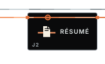</picture></a><a href="https://www.linkedin.com/in/ayush-yadav-developer"><picture><source media="(prefers-color-scheme: light) and (max-width: 500px)" srcset="./assets/light/m-port-linkedin.svg"><source media="(prefers-color-scheme: light)" srcset="./assets/light/plate-port-linkedin.svg"><source media="(max-width: 500px)" srcset="./assets/m-port-linkedin.svg"></picture></a><a href="mailto:aesh.03.23@gmail.com"><picture><source media="(prefers-color-scheme: light) and (max-width: 500px)" srcset="./assets/light/m-port-email.svg"><source media="(prefers-color-scheme: light)" srcset="./assets/light/plate-port-email.svg"><source media="(max-width: 500px)" srcset="./assets/m-port-email.svg"></picture></a>
<picture><source media="(prefers-color-scheme: light) and (max-width: 500px)" srcset="./assets/light/m-link-return.svg"><source media="(prefers-color-scheme: light)" srcset="./assets/light/plate-link-return.svg"><source media="(max-width: 500px)" srcset="./assets/m-link-return.svg"></picture>
<picture><source media="(prefers-color-scheme: light) and (max-width: 500px)" srcset="./assets/light/m-dive.svg"><source media="(prefers-color-scheme: light)" srcset="./assets/light/plate-dive.svg"><source media="(max-width: 500px)" srcset="./assets/m-dive.svg"></picture>

**C++ · TypeScript · Python · Java · Swift · Rust** — B.S. Computer Science, Miami University (May 2026). Cincinnati, Ohio. Open to full-time software engineering roles.

Seven systems. Every number is drawn on the plate beside it and re-derived in CI from a pinned commit, except §I and §VII's grant, which are my word and say so where they stand. Four of them ship a **system card**, a print-format walkthrough of the architecture and the evidence.

<picture><source media="(prefers-color-scheme: light) and (max-width: 500px)" srcset="./assets/light/m-resurface.svg"><source media="(prefers-color-scheme: light)" srcset="./assets/light/plate-resurface.svg"><source media="(max-width: 500px)" srcset="./assets/m-resurface.svg"></picture>
<picture><source media="(prefers-color-scheme: light) and (max-width: 500px)" srcset="./assets/light/m-1-work.svg"><source media="(prefers-color-scheme: light)" srcset="./assets/light/plate-1-work.svg"><source media="(max-width: 500px)" srcset="./assets/m-1-work.svg">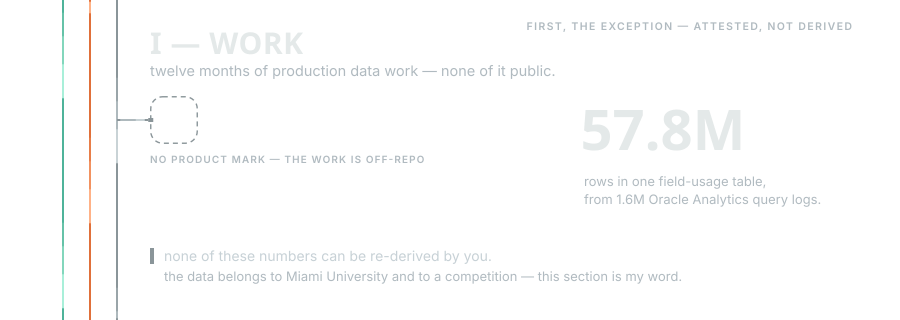</picture>
<picture><source media="(prefers-color-scheme: light) and (max-width: 500px)" srcset="./assets/light/m-dive.svg"><source media="(prefers-color-scheme: light)" srcset="./assets/light/plate-dive.svg"><source media="(max-width: 500px)" srcset="./assets/m-dive.svg"></picture>

ITSM Data Integration Intern at Miami University, June 2025 to May 2026, and team lead of three at DataFest 2026. This is the only section whose numbers you cannot check for yourself, and the plate says so on its face.

<picture><source media="(prefers-color-scheme: light) and (max-width: 500px)" srcset="./assets/light/m-resurface.svg"><source media="(prefers-color-scheme: light)" srcset="./assets/light/plate-resurface.svg"><source media="(max-width: 500px)" srcset="./assets/m-resurface.svg"></picture>
<picture><source media="(prefers-color-scheme: light) and (max-width: 500px)" srcset="./assets/light/m-2-jetpack.svg"><source media="(prefers-color-scheme: light)" srcset="./assets/light/plate-2-jetpack.svg"><source media="(max-width: 500px)" srcset="./assets/m-2-jetpack.svg"></picture>
<picture><source media="(prefers-color-scheme: light) and (max-width: 500px)" srcset="./assets/light/m-probe-rust-s1.svg"><source media="(prefers-color-scheme: light)" srcset="./assets/light/plate-probe-rust-s1.svg"><source media="(max-width: 500px)" srcset="./assets/m-probe-rust-s1.svg">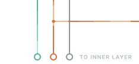</picture><a href="https://jetpack-compress.vercel.app"><picture><source media="(prefers-color-scheme: light) and (max-width: 500px)" srcset="./assets/light/m-probe-rust-s2.svg"><source media="(prefers-color-scheme: light)" srcset="./assets/light/plate-probe-rust-s2.svg"><source media="(max-width: 500px)" srcset="./assets/m-probe-rust-s2.svg">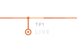</picture></a><a href="https://jetpack-compress.vercel.app/system-card"><picture><source media="(prefers-color-scheme: light) and (max-width: 500px)" srcset="./assets/light/m-probe-rust-s3.svg"><source media="(prefers-color-scheme: light)" srcset="./assets/light/plate-probe-rust-s3.svg"><source media="(max-width: 500px)" srcset="./assets/m-probe-rust-s3.svg">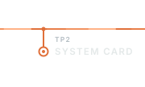</picture></a><a href="https://github.com/yadava5/jetpack-compress"><picture><source media="(prefers-color-scheme: light) and (max-width: 500px)" srcset="./assets/light/m-probe-rust-s4.svg"><source media="(prefers-color-scheme: light)" srcset="./assets/light/plate-probe-rust-s4.svg"><source media="(max-width: 500px)" srcset="./assets/m-probe-rust-s4.svg">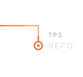</picture></a>

Parallel gzip on JDK 25 — one virtual thread per block, a bounded in-flight window so peak memory is independent of file size, and a byte-valid *single* gzip member rather than the concatenated members parallel compressors usually emit.

<picture><source media="(prefers-color-scheme: light) and (max-width: 500px)" srcset="./assets/light/m-resurface.svg"><source media="(prefers-color-scheme: light)" srcset="./assets/light/plate-resurface.svg"><source media="(max-width: 500px)" srcset="./assets/m-resurface.svg"></picture>
<picture><source media="(prefers-color-scheme: light) and (max-width: 500px)" srcset="./assets/light/m-3-glyph.svg"><source media="(prefers-color-scheme: light)" srcset="./assets/light/plate-3-glyph.svg"><source media="(max-width: 500px)" srcset="./assets/m-3-glyph.svg"></picture>
<picture><source media="(prefers-color-scheme: light) and (max-width: 500px)" srcset="./assets/light/m-probe-rust-s1.svg"><source media="(prefers-color-scheme: light)" srcset="./assets/light/plate-probe-rust-s1.svg"><source media="(max-width: 500px)" srcset="./assets/m-probe-rust-s1.svg"></picture><a href="https://getglyph.vercel.app"><picture><source media="(prefers-color-scheme: light) and (max-width: 500px)" srcset="./assets/light/m-probe-rust-s2.svg"><source media="(prefers-color-scheme: light)" srcset="./assets/light/plate-probe-rust-s2.svg"><source media="(max-width: 500px)" srcset="./assets/m-probe-rust-s2.svg"></picture></a><a href="https://getglyph.vercel.app/system-card"><picture><source media="(prefers-color-scheme: light) and (max-width: 500px)" srcset="./assets/light/m-probe-rust-s3.svg"><source media="(prefers-color-scheme: light)" srcset="./assets/light/plate-probe-rust-s3.svg"><source media="(max-width: 500px)" srcset="./assets/m-probe-rust-s3.svg"></picture></a><a href="https://github.com/yadava5/glyph"><picture><source media="(prefers-color-scheme: light) and (max-width: 500px)" srcset="./assets/light/m-probe-rust-s4.svg"><source media="(prefers-color-scheme: light)" srcset="./assets/light/plate-probe-rust-s4.svg"><source media="(max-width: 500px)" srcset="./assets/m-probe-rust-s4.svg"></picture></a>

The network is not mine: a course-provided C++ MNIST net. The work is what happened to it — hand-written SIMD kernels over a scalar fallback, with **Shree Chaturvedi** credited for kernel contributions. The React browser application is mine.

<picture><source media="(prefers-color-scheme: light) and (max-width: 500px)" srcset="./assets/light/m-resurface.svg"><source media="(prefers-color-scheme: light)" srcset="./assets/light/plate-resurface.svg"><source media="(max-width: 500px)" srcset="./assets/m-resurface.svg"></picture>
<picture><source media="(prefers-color-scheme: light) and (max-width: 500px)" srcset="./assets/light/m-4-automl.svg"><source media="(prefers-color-scheme: light)" srcset="./assets/light/plate-4-automl.svg"><source media="(max-width: 500px)" srcset="./assets/m-4-automl.svg">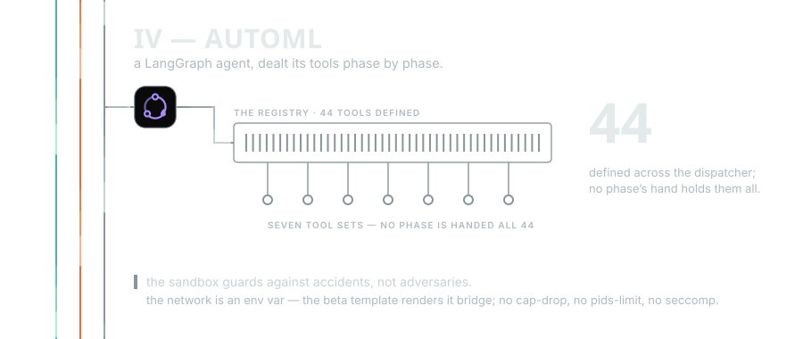</picture>
<picture><source media="(prefers-color-scheme: light) and (max-width: 500px)" srcset="./assets/light/m-probe-zinc-s1.svg"><source media="(prefers-color-scheme: light)" srcset="./assets/light/plate-probe-zinc-s1.svg"><source media="(max-width: 500px)" srcset="./assets/m-probe-zinc-s1.svg">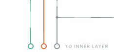</picture><a href="https://agentic-automl-platform.vercel.app"><picture><source media="(prefers-color-scheme: light) and (max-width: 500px)" srcset="./assets/light/m-probe-zinc-s2.svg"><source media="(prefers-color-scheme: light)" srcset="./assets/light/plate-probe-zinc-s2.svg"><source media="(max-width: 500px)" srcset="./assets/m-probe-zinc-s2.svg"></picture></a><a href="https://agentic-automl-platform.vercel.app/system-card"><picture><source media="(prefers-color-scheme: light) and (max-width: 500px)" srcset="./assets/light/m-probe-zinc-s3.svg"><source media="(prefers-color-scheme: light)" srcset="./assets/light/plate-probe-zinc-s3.svg"><source media="(max-width: 500px)" srcset="./assets/m-probe-zinc-s3.svg">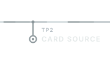</picture></a><a href="https://github.com/yadava5/ai-augmented-auto-ml-toolchain"><picture><source media="(prefers-color-scheme: light) and (max-width: 500px)" srcset="./assets/light/m-probe-zinc-s4.svg"><source media="(prefers-color-scheme: light)" srcset="./assets/light/plate-probe-zinc-s4.svg"><source media="(max-width: 500px)" srcset="./assets/m-probe-zinc-s4.svg">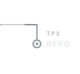</picture></a>

A dataset and a sentence in, a trained model out, over a LangGraph state machine and an MCP tool server. **GPL-3.0** at the commit this page pins; a relicence to PolyForm Noncommercial is proposed in [PR #5](https://github.com/yadava5/ai-augmented-auto-ml-toolchain/pull/5), which still targets the pre-repin history, and needs my co-author's review.

<picture><source media="(prefers-color-scheme: light) and (max-width: 500px)" srcset="./assets/light/m-resurface.svg"><source media="(prefers-color-scheme: light)" srcset="./assets/light/plate-resurface.svg"><source media="(max-width: 500px)" srcset="./assets/m-resurface.svg"></picture>
<picture><source media="(prefers-color-scheme: light) and (max-width: 500px)" srcset="./assets/light/m-5-cadence.svg"><source media="(prefers-color-scheme: light)" srcset="./assets/light/plate-5-cadence.svg"><source media="(max-width: 500px)" srcset="./assets/m-5-cadence.svg">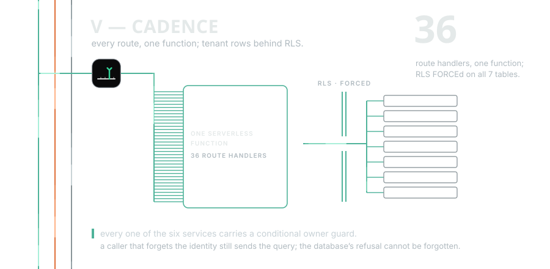</picture>
<picture><source media="(prefers-color-scheme: light) and (max-width: 500px)" srcset="./assets/light/m-probe-verd-s1.svg"><source media="(prefers-color-scheme: light)" srcset="./assets/light/plate-probe-verd-s1.svg"><source media="(max-width: 500px)" srcset="./assets/m-probe-verd-s1.svg">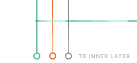</picture><a href="https://usecadenceapp.vercel.app"><picture><source media="(prefers-color-scheme: light) and (max-width: 500px)" srcset="./assets/light/m-probe-verd-s2.svg"><source media="(prefers-color-scheme: light)" srcset="./assets/light/plate-probe-verd-s2.svg"><source media="(max-width: 500px)" srcset="./assets/m-probe-verd-s2.svg">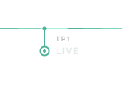</picture></a><a href="https://usecadenceapp.vercel.app/system-card"><picture><source media="(prefers-color-scheme: light) and (max-width: 500px)" srcset="./assets/light/m-probe-verd-s3.svg"><source media="(prefers-color-scheme: light)" srcset="./assets/light/plate-probe-verd-s3.svg"><source media="(max-width: 500px)" srcset="./assets/m-probe-verd-s3.svg">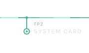</picture></a><a href="https://github.com/yadava5/cadence"><picture><source media="(prefers-color-scheme: light) and (max-width: 500px)" srcset="./assets/light/m-probe-verd-s4.svg"><source media="(prefers-color-scheme: light)" srcset="./assets/light/plate-probe-verd-s4.svg"><source media="(max-width: 500px)" srcset="./assets/m-probe-verd-s4.svg">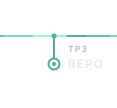</picture></a><a href="https://github.com/yadava5/cadence/blob/main/lib/__tests__/rls.postgres.test.ts"><picture><source media="(prefers-color-scheme: light) and (max-width: 500px)" srcset="./assets/light/m-probe-cadence-s5.svg"><source media="(prefers-color-scheme: light)" srcset="./assets/light/plate-probe-cadence-s5.svg"><source media="(max-width: 500px)" srcset="./assets/m-probe-cadence-s5.svg"></picture></a>

Type *lunch with sam friday 1pm* and get a task dated Friday 1pm; drag it onto the calendar to make it an event. The engineering is what the audit turned up: application code that filters by user is code that has to remember to filter, so the database enforces it instead.

<picture><source media="(prefers-color-scheme: light) and (max-width: 500px)" srcset="./assets/light/m-resurface.svg"><source media="(prefers-color-scheme: light)" srcset="./assets/light/plate-resurface.svg"><source media="(max-width: 500px)" srcset="./assets/m-resurface.svg"></picture>
<picture><source media="(prefers-color-scheme: light) and (max-width: 500px)" srcset="./assets/light/m-6-applied.svg"><source media="(prefers-color-scheme: light)" srcset="./assets/light/plate-6-applied.svg"><source media="(max-width: 500px)" srcset="./assets/m-6-applied.svg">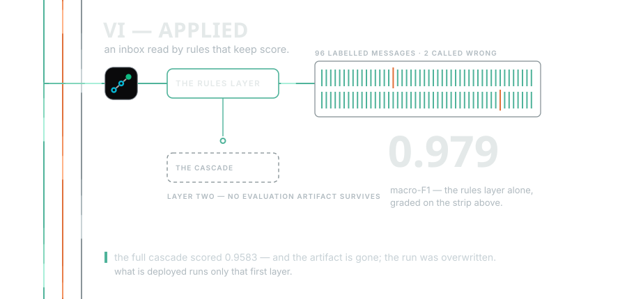</picture>
<picture><source media="(prefers-color-scheme: light) and (max-width: 500px)" srcset="./assets/light/m-probe-verd-s1.svg"><source media="(prefers-color-scheme: light)" srcset="./assets/light/plate-probe-verd-s1.svg"><source media="(max-width: 500px)" srcset="./assets/m-probe-verd-s1.svg"></picture><a href="https://getapplied.vercel.app"><picture><source media="(prefers-color-scheme: light) and (max-width: 500px)" srcset="./assets/light/m-probe-verd-s2.svg"><source media="(prefers-color-scheme: light)" srcset="./assets/light/plate-probe-verd-s2.svg"><source media="(max-width: 500px)" srcset="./assets/m-probe-verd-s2.svg"></picture></a><a href="https://getapplied.vercel.app/system-card"><picture><source media="(prefers-color-scheme: light) and (max-width: 500px)" srcset="./assets/light/m-probe-verd-s3.svg"><source media="(prefers-color-scheme: light)" srcset="./assets/light/plate-probe-verd-s3.svg"><source media="(max-width: 500px)" srcset="./assets/m-probe-verd-s3.svg"></picture></a><a href="https://github.com/yadava5/applied"><picture><source media="(prefers-color-scheme: light) and (max-width: 500px)" srcset="./assets/light/m-probe-verd-s4.svg"><source media="(prefers-color-scheme: light)" srcset="./assets/light/plate-probe-verd-s4.svg"><source media="(max-width: 500px)" srcset="./assets/m-probe-verd-s4.svg"></picture></a><a href="https://huggingface.co/spaces/yadava5/jobtracker-classifier"><picture><source media="(prefers-color-scheme: light) and (max-width: 500px)" srcset="./assets/light/m-probe-applied-s5.svg"><source media="(prefers-color-scheme: light)" srcset="./assets/light/plate-probe-applied-s5.svg"><source media="(max-width: 500px)" srcset="./assets/m-probe-applied-s5.svg">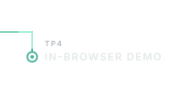</picture></a>

Your inbox already holds the verdict on most applications you have sent. Three layers read it, cheapest first, and anything under the confidence gate is withheld from the board and walked to a human. The model is allowed to say it does not know.

<picture><source media="(prefers-color-scheme: light) and (max-width: 500px)" srcset="./assets/light/m-resurface.svg"><source media="(prefers-color-scheme: light)" srcset="./assets/light/plate-resurface.svg"><source media="(max-width: 500px)" srcset="./assets/m-resurface.svg"></picture>
<picture><source media="(prefers-color-scheme: light) and (max-width: 500px)" srcset="./assets/light/m-7-visualassist.svg"><source media="(prefers-color-scheme: light)" srcset="./assets/light/plate-7-visualassist.svg"><source media="(max-width: 500px)" srcset="./assets/m-7-visualassist.svg">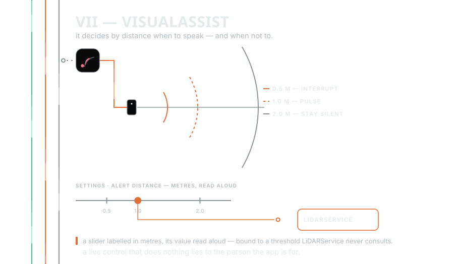</picture>
<picture><source media="(prefers-color-scheme: light) and (max-width: 500px)" srcset="./assets/light/m-probe-rust-s1.svg"><source media="(prefers-color-scheme: light)" srcset="./assets/light/plate-probe-rust-s1.svg"><source media="(max-width: 500px)" srcset="./assets/m-probe-rust-s1.svg"></picture><a href="https://github.com/yadava5/VisualAssist"><picture><source media="(prefers-color-scheme: light) and (max-width: 500px)" srcset="./assets/light/m-probe-va-s2.svg"><source media="(prefers-color-scheme: light)" srcset="./assets/light/plate-probe-va-s2.svg"><source media="(max-width: 500px)" srcset="./assets/m-probe-va-s2.svg">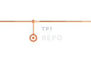</picture></a><picture><source media="(prefers-color-scheme: light) and (max-width: 500px)" srcset="./assets/light/m-probe-va-s3.svg"><source media="(prefers-color-scheme: light)" srcset="./assets/light/plate-probe-va-s3.svg"><source media="(max-width: 500px)" srcset="./assets/m-probe-va-s3.svg">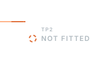</picture>

An iPhone app for low-vision users, in Swift: ARKit LiDAR depth becomes speech and haptics, so the phone tells you what is in front of you before you reach it. MUCAT Design Innovation finalist, with a **$2,500** prototyping grant — attested, like §I. It is the one system here you cannot click into; it needs an iPhone with a lidar sensor in your hand.

<picture><source media="(prefers-color-scheme: light) and (max-width: 500px)" srcset="./assets/light/m-resurface.svg"><source media="(prefers-color-scheme: light)" srcset="./assets/light/plate-resurface.svg"><source media="(max-width: 500px)" srcset="./assets/m-resurface.svg"></picture>
<picture><source media="(prefers-color-scheme: light) and (max-width: 500px)" srcset="./assets/light/m-colophon.svg"><source media="(prefers-color-scheme: light)" srcset="./assets/light/plate-colophon.svg"><source media="(max-width: 500px)" srcset="./assets/m-colophon.svg">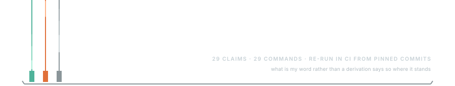</picture>

[`build/claims.json`](https://github.com/yadava5/yadava5/blob/main/build/claims.json) ties every derived number to a commit SHA and to the shell command that re-derives it from the blob at that SHA. [The gate](https://github.com/yadava5/yadava5/blob/main/.github/workflows/gate.yml) runs those commands on every push and once a day, rejects any number no row accounts for, and closes with a negative test that breaks the plates on purpose and fails if a check sleeps through it.

The guarantee is narrower than it sounds: **numbers are gated, prose is not.** Every false claim an audit has turned up on this page has been a verb, not a figure.

Everything above, with **LifeQuest** — a quest tracker for people rebuilding after a layoff or retirement — is collected at **[ayush-yadav.com](https://ayush-yadav.com)**.

