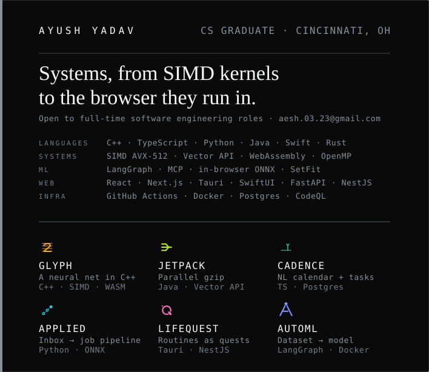
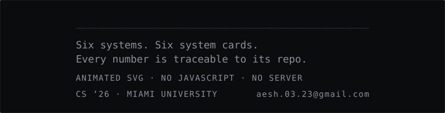

I build systems that prove themselves. Six of them are live, publicly reachable, and each ships a **system card** — a printed-quality walkthrough of the architecture and the evidence behind its numbers.

What follows is five system plates (LifeQuest and AutoML share the last), plus one for the habit that runs underneath all of them, between an opening and a colophon. Each shows the claim, then the mechanism that would catch the claim if it were a lie.

---

## I · Glyph — *I don't trust the library*

<picture>
  <source media="(max-width: 500px)" srcset="./assets/m-1-glyph.svg">
  
</picture>

A neural network written **from scratch in C++** — no framework — with hand-written SIMD kernels for AVX-512, AVX2, NEON and wasm128, compiled to WebAssembly — and the live demo runs it: `vercel.json` builds with `VITE_ENABLE_WASM=true` and the site serves a 46,960-byte `.wasm`. A labelled JS matcher ships as the fallback path, and the app marks it "never used for accuracy or timing claims".

**97.01%** on the 10,000-image MNIST test set — 9,701 right, so **299 wrong**.

That same test set also selected the checkpoint and triggered early stopping (`apps/train_model.cpp:219-243`), so treat it as a training-time number, not a clean held-out one. The run wasn't seeded either. The grid above draws all 299 — each mark the true label of an image the model missed.

[live](https://getglyph.vercel.app) · [system card](https://getglyph.vercel.app/system-card) · [repo](https://github.com/yadava5/glyph)

---

## II · jetpack — *I don't trust my own optimisation*

<picture>
  <source media="(max-width: 500px)" srcset="./assets/m-2-jetpack.svg">
  
</picture>

Parallel, gzip-compatible compression on **JDK 25**: one virtual thread per block, a bounded in-flight window so peak memory is independent of file size, and memory-mapped input via the Foreign Function & Memory API.

The checksum is hand-vectorised — so it is checked **bit-identical against `java.util.zip.Adler32`** across every input the test suite throws at it. The output is a byte-valid single gzip member any tool can decompress.

**422 MB/s parallel vs 66.2 MB/s single-threaded — 6.4×** on an M1 Pro (10 cores). That is a 3-fork JMH run with a 99.9% confidence interval of ±5%, committed at [`benchmarks/jmh-results-rigorous.json`](https://github.com/yadava5/jetpack-compress/blob/main/benchmarks/jmh-results-rigorous.json) with the machine spec beside it, so you can re-run it and check.

And the row that stays in the table because it's true: the hand-vectorised Adler-32 reaches **4.26 GB/s**, while the JDK's own native intrinsic does **14.06 GB/s**. I don't beat it. The SIMD result is honest against the *scalar* baseline (2.80×, reproduced to three significant figures across two independent runs), and the intrinsic is printed next to it as the reference it loses to.

[live](https://jetpack-compress.vercel.app) · [system card](https://jetpack-compress.vercel.app/system-card) · [repo](https://github.com/yadava5/jetpack-compress)

---

## III · Cadence — *I don't trust the black box*

<picture>
  <source media="(max-width: 500px)" srcset="./assets/m-3-cadence.svg">
  
</picture>

A sentence typed the way you would say it becomes a calendar entry. The parser runs four stages — chrono, hashtag, priority, language — and **every extracted span records the parser that produced it** — `source` is a required field on every tag, and conflict resolution depends on it, so a wrong answer is always traceable to the stage that caused it.

**36 API handlers bundled into a single serverless function**, to live inside Vercel's 12-function cap without giving up routes.

[live](https://usecadenceapp.vercel.app) · [system card](https://usecadenceapp.vercel.app/system-card) · [repo](https://github.com/yadava5/cadence)

---

## IV · Applied — *I don't trust the model*

<picture>
  <source media="(max-width: 500px)" srcset="./assets/m-4-applied.svg">
  
</picture>

Your inbox already holds the verdict on most applications you've sent. A three-layer cascade reads it: **201 regex rules → e5 embeddings → a fine-tuned SetFit head**, cheapest first.

**0.979 macro-F1**, and CI fails the build below 0.95. Anything under the **0.85 confidence gate** is not guessed at — it goes to a human. The model is allowed to say it doesn't know.

The fine-tuned head exports to int8 ONNX (90.4 MB → 22.8 MB) and runs **in your browser**: the server ships the weights once, then classification happens in your tab and nothing you paste leaves it. `allowRemoteModels = false` keeps the model local. That in-browser build is the [Hugging Face Space](https://huggingface.co/spaces/yadava5/jobtracker-classifier); the `[live]` link below runs the rules layer only.

[live](https://getapplied.vercel.app) · [system card](https://getapplied.vercel.app/system-card) · [repo](https://github.com/yadava5/applied)

---

## V · The refusal — *I don't trust myself*

<picture>
  <source media="(max-width: 500px)" srcset="./assets/m-5-refusal.svg">
  
</picture>

Application code that filters by user is code that has to *remember* to filter. So the database enforces it instead: **PostgreSQL Row-Level Security**, `FORCE`d on every tenant table, with the app connecting as a dedicated non-`BYPASSRLS` role and the request identity carried as a transaction-local GUC.

The test that matters runs a raw, unfiltered `SELECT` as user B. It returns **user B's rows only** — because the database refused, not because the query remembered.

Auditing my own work, I found **seven IDOR vulnerabilities** in Cadence — endpoints where any authenticated user could read or delete another user's records by id. All seven are fixed; six carry a regression test asserting the scoped SQL, and the task-lists one does not yet.

[the migration](https://github.com/yadava5/cadence/blob/main/lib/config/migrations/0002_enable_rls.sql) · [the app role](https://github.com/yadava5/cadence/blob/main/lib/config/migrations/0003_create_cadence_app_role.sql) · [the isolation suite](https://github.com/yadava5/cadence/blob/main/lib/__tests__/rls.postgres.test.ts)

---

## VI · LifeQuest & Agentic AutoML

<picture>
  <source media="(max-width: 500px)" srcset="./assets/m-6-release.svg">
  
</picture>

**LifeQuest** turns real-world routines into tracked quests with tiered progression — built for people rebuilding structure, whether after a layoff or in retirement. Tauri + React client, NestJS + Prisma API.

**Agentic AutoML** takes a dataset and returns a deployed model: LangGraph orchestration over an MCP tool registry, Python executed in a hardened Docker sandbox — non-root, read-only rootfs, no network, capped memory and CPU — and human approval gates before a preprocessing step is committed and before a model is trained. Worth being exact: preprocessing runs the code *before* it asks, so the gate protects what gets persisted rather than what gets spent — and whether a step needs approval is itself proposed by the model, with a keyword fallback. Senior design at Miami University, co-built with Shree Chaturvedi.

[LifeQuest](https://getlifequest.vercel.app) · [system card](https://getlifequest.vercel.app/system-card) — [AutoML](https://agentic-automl-platform.vercel.app) · [system card](https://agentic-automl-platform.vercel.app/system-card)

---

Open to summer 2026 internships and collaborations — **[aesh.03.23@gmail.com](mailto:aesh.03.23@gmail.com)** · [LinkedIn](https://www.linkedin.com/in/ayush-yadav-developer)

