<picture>
  <source media="(prefers-color-scheme: light) and (max-width: 500px)" srcset="./assets/light/m-0-thesis.svg">
  <source media="(prefers-color-scheme: light)" srcset="./assets/light/plate-0-thesis.svg">
  <source media="(max-width: 500px)" srcset="./assets/m-0-thesis.svg">
  
</picture>

## &nbsp;→&nbsp; [**ayush-yadav.com**](https://ayush-yadav.com) &nbsp;←&nbsp;

### [Portfolio](https://ayush-yadav.com) &nbsp;·&nbsp; [Résumé](https://ayush-yadav.com/resume.pdf) &nbsp;·&nbsp; [Email](mailto:aesh.03.23@gmail.com) &nbsp;·&nbsp; [LinkedIn](https://www.linkedin.com/in/ayush-yadav-developer)

**Open to full-time software engineering roles.**

---

**C++ · TypeScript · Python · Java · Swift · Rust** — B.S. Computer Science, Miami University (May 2026). Based in Cincinnati, OH.

Every section started as a question I wanted answered, and every number in the answers is recomputed in CI from a pinned commit — except §I and the grant in §VII, which are my word and say so where they stand. Four systems ship a **system card**, a print-format walkthrough of the architecture and the evidence.

---

## I · Work — *a year of it, and it isn't in a repo*

<picture>
  <source media="(prefers-color-scheme: light) and (max-width: 500px)" srcset="./assets/light/m-0b-work.svg">
  <source media="(prefers-color-scheme: light)" srcset="./assets/light/plate-0b-work.svg">
  <source media="(max-width: 500px)" srcset="./assets/m-0b-work.svg">
  
</picture>

For a year — June 2025 to May 2026 — I was **ITSM Data Integration Intern at Miami University**. A Python pipeline turned **1.6M Oracle Analytics query logs** into a **57.8M-row** field-usage table; asset data siloed across Tableau and Workday became one **10,453-row** master inventory; and a legacy Laravel compliance reporter became a clean ETL feed behind a dashboard that lifted code compliance **from 0% to 96.72%** across **61** projects.

At **DataFest 2026** I led a three-person team in the national ASA competition: 90-day care utilisation for **349K patients**, **0.90 holdout AUC**, SHAP-explained. The hard part was not the model — it was the join. **7.7M encounters (1.4 GB)** through a DuckDB + Polars star schema preserved **99.6%** of social-determinant linkage; the naive join everyone reaches for first kept **32%**.

The warrant differs here, and only here: **none of these numbers can be re-derived by you.** The data belongs to Miami University and to a competition; this section is my word, and the plate says so on its face.

---

## II · jetpack — *is hand-vectorised code actually faster?*

<picture>
  <source media="(prefers-color-scheme: light) and (max-width: 500px)" srcset="./assets/light/m-2-jetpack.svg">
  <source media="(prefers-color-scheme: light)" srcset="./assets/light/plate-2-jetpack.svg">
  <source media="(max-width: 500px)" srcset="./assets/m-2-jetpack.svg">
  
</picture>

The question that started it: the JDK ships a native Adler-32 intrinsic — can hand-written Vector API code compete? Building the testbed produced a real tool: parallel, gzip-compatible compression on **JDK 25**, one virtual thread per block, a bounded in-flight window so peak memory is independent of file size. The output is a byte-valid single gzip member any tool can decompress.

The answer came back both ways, and both are printed. Parallelism: **422 MB/s against 66.2 MB/s single-threaded — 6.4×** on an M1 Pro (10 cores), from a 3-fork JMH run whose 99.9% intervals span ±0.7% to ±6.9%, committed at [`benchmarks/jmh-results-rigorous.json`](https://github.com/yadava5/jetpack-compress/blob/main/benchmarks/jmh-results-rigorous.json). That ratio is also the least stable number here — **6.89× → 6.38×** between the quick run and the rigorous one — and `benchmarks/ENVIRONMENT.md` says so.

The checksum: my hand-vectorised Adler-32 reaches **4.26 GB/s**, verified **bit-identical against `java.util.zip.Adler32`** — 2.80× on the 3-fork run against the **1.52 GB/s** scalar baseline, 2.92× on the quick one. The JDK's own intrinsic does **14.06 GB/s**. I don't beat it, and the plate draws it as the longest bar.

[live](https://jetpack-compress.vercel.app) · [system card](https://jetpack-compress.vercel.app/system-card) · [repo](https://github.com/yadava5/jetpack-compress)

---

## III · Glyph — *how much faster can you make code you didn't write?*

<picture>
  <source media="(prefers-color-scheme: light) and (max-width: 500px)" srcset="./assets/light/m-1-glyph.svg">
  <source media="(prefers-color-scheme: light)" srcset="./assets/light/plate-1-glyph.svg">
  <source media="(max-width: 500px)" srcset="./assets/m-1-glyph.svg">
  
</picture>

The network is not mine: a **course-provided C++ MNIST network**, a two-layer MLP after Nielsen. The work is what happened to it — hand-written SIMD kernels for **AVX-512, AVX2 and NEON** over a scalar fallback, with **Shree Chaturvedi** credited for kernel contributions, and the React/TypeScript browser application, which is mine.

The committed benchmarks answer the question in both directions. **3.5×** on `benchDot/256` under OpenMP + native codegen against the course baseline — a ratio that survives three committed runs. And on `benchAxpy/128`, the same flags run **6.9× slower**: below a size floor, threading costs more than it pays. Both numbers derive from the same pinned `bench_summary.csv`.

What the optimisation must not change is the answers: **97.01%** on the 10,000-image MNIST test set — **299 wrong**, every one drawn on the plate. That same test set also selected the checkpoint and triggered early stopping (`apps/train_model.cpp:219-243`), so treat it as a training-time number, not a clean held-out one; the run wasn't seeded either.

The browser build carries real `wasm_simd128` intrinsics on `main` (`src/NeuralNet.cpp`), compiled with `-msimd128` (`CMakeLists.txt:332`). `curl -s https://getglyph.vercel.app/wasm/fast_mnist.wasm | shasum -a 256` gives `e681d2f76d41305aa3b8c250799f898bd1139497f60580ed59000d49cf5d6360` — **43,751 bytes**, served as `application/wasm`, **byte-identical to the blob on `main`.** The deployment is what the repository builds, and this page's CI fails the moment that stops being true.

[live](https://getglyph.vercel.app) · [system card](https://getglyph.vercel.app/system-card) · [repo](https://github.com/yadava5/glyph)

---

## IV · Agentic AutoML — *how much should a model be allowed to hold?*

<picture>
  <source media="(prefers-color-scheme: light) and (max-width: 500px)" srcset="./assets/light/m-6b-automl.svg">
  <source media="(prefers-color-scheme: light)" srcset="./assets/light/plate-6b-automl.svg">
  <source media="(max-width: 500px)" srcset="./assets/m-6b-automl.svg">
  
</picture>

**Agentic AutoML** takes a dataset and a sentence and gives back a trained model, driven by a LangGraph state machine over an MCP tool server. The part worth looking at is what the model is allowed to hold. The registry has **44** tool definitions, but `LLM_TOOL_DEFINITIONS` — the set that travels with the model everywhere — is **15** of them: data, cell and package tools. The other 29 arrive with the phase that needs them, through seven exported sets. A model in the training phase cannot reach a preprocessing tool, because it was never handed one.

The Python it writes runs in a container on a Docker network created with `--internal` — no gateway, so nothing inside can route out — with a `--read-only` root, a non-root user and datasets mounted `:ro`. Five `--tmpfs` mounts are the entire writable surface, and none of it survives the container. When a cell raises, the repair loop re-prompts on the actual traceback rather than a summary of it.

Behind that: a **29**-table Postgres schema with pgvector, and a per-project Jupyter kernel so state survives between cells.

Licensed **GPL-3.0** at the commit this page pins. A relicence to PolyForm Noncommercial is proposed in [PR #5](https://github.com/yadava5/ai-augmented-auto-ml-toolchain/pull/5) and needs my co-author's review; until it merges, GPL-3.0 is what you get.

[AutoML](https://agentic-automl-platform.vercel.app) · [expo booklet](https://agentic-automl-platform.vercel.app/system-card) · [repo](https://github.com/yadava5/ai-augmented-auto-ml-toolchain)

---

## V · Cadence — *can the database refuse, so the code needn't remember?*

<picture>
  <source media="(prefers-color-scheme: light) and (max-width: 500px)" srcset="./assets/light/m-5-refusal.svg">
  <source media="(prefers-color-scheme: light)" srcset="./assets/light/plate-5-refusal.svg">
  <source media="(max-width: 500px)" srcset="./assets/m-5-refusal.svg">
  
</picture>

**Cadence** turns a sentence typed the way you would say it — *lunch with sam friday 1pm* — into a calendar entry, and bundles its **36 API handlers into one serverless function** because the hosting plan allows 12. The engineering worth your attention is what happened when I audited it.

Application code that filters by user is code that has to *remember* to filter. So the database enforces it instead: **PostgreSQL Row-Level Security**, `FORCE`d on all **seven** tenant tables, with the request identity carried as a transaction-local GUC. The test that matters runs a raw, unfiltered `SELECT count(*) FROM tasks` as user B — and it returns **user B's rows only**, because the database refused, not because the query remembered. One caveat: production still connects as the owner role, which carries `BYPASSRLS`, so deployed RLS is staged rather than load-bearing — the isolation suite proves the cutover through the production pooler, and one `DATABASE_URL` swap remains ([`RLS-CUTOVER.md`](https://github.com/yadava5/cadence/blob/main/docs/RLS-CUTOVER.md)).

The audit that motivated it: in **six services**, any authenticated user could read or delete another user's records by id — the service dropped the `userId` and fell through to an unscoped `WHERE id = $1`. All six now carry the owner guard in the read query itself; on delete, three carry it in the query and the other three check ownership first — and the one worth naming is tags, whose existing test asserted the *vulnerable* query and would have stayed green forever.

[live](https://usecadenceapp.vercel.app) · [system card](https://usecadenceapp.vercel.app/system-card) · [repo](https://github.com/yadava5/cadence) · [the isolation suite](https://github.com/yadava5/cadence/blob/main/lib/__tests__/rls.postgres.test.ts)

---

## VI · Applied — *what should a classifier do when it isn't sure?*

<picture>
  <source media="(prefers-color-scheme: light) and (max-width: 500px)" srcset="./assets/light/m-4-applied.svg">
  <source media="(prefers-color-scheme: light)" srcset="./assets/light/plate-4-applied.svg">
  <source media="(max-width: 500px)" srcset="./assets/m-4-applied.svg">
  
</picture>

Your inbox already holds the verdict on most applications you've sent. A three-layer cascade reads it: **201 regex rules → e5 embeddings → a fine-tuned SetFit head**, cheapest first — and anything under the **0.85 confidence gate** goes to a human instead of being guessed at. The model is allowed to say it doesn't know.

**0.979 macro-F1** on a 96-message, 8-class evaluation set — that score is **2 mistakes**, on a set balanced at 12 per class, so one more error moves it about a point. CI fails the build below 0.95.

The label matters: that score comes from the `deterministic` profile — SetFit head off, embedding store empty — so it measures **the rules layer alone**. The full cascade's own score, 0.9583, has **no evaluation artifact**: the run that produced it was overwritten and the number survives only as prose (`docs/ML_EXECUTION_TRACKER.md:378`). I can hand you an artifact for one and not the other, so 0.979 is what the plate draws, labelled for what it measures.

The fine-tuned head exports to int8 ONNX (90.4 MB → 22.8 MB) and runs **in your browser**: the server ships the weights once, then classification happens in your tab and nothing you paste leaves it. That build is the [Hugging Face Space](https://huggingface.co/spaces/yadava5/jobtracker-classifier); the `[live]` link below runs the rules layer only.

[live](https://getapplied.vercel.app) · [system card](https://getapplied.vercel.app/system-card) · [repo](https://github.com/yadava5/applied)

---

## VII · VisualAssist — *can a phone tell you what's in front of you?*

<picture>
  <source media="(prefers-color-scheme: light) and (max-width: 500px)" srcset="./assets/light/m-8-visualassist.svg">
  <source media="(prefers-color-scheme: light)" srcset="./assets/light/plate-8-visualassist.svg">
  <source media="(max-width: 500px)" srcset="./assets/m-8-visualassist.svg">
  
</picture>

The banner at the top of this page sells **Swift**; this is the Swift. **VisualAssist** is an iPhone app for low-vision users: ARKit LiDAR depth becomes spatial audio, haptics and speech, so the phone tells you what is in front of you before you reach it. **7,177 lines across 38 Swift files**, a real test target, **5 CI workflows** (build, CodeQL, gitleaks, release, scorecard). It is the artifact behind the MUCAT Design Innovation finalist placement and its **$2,500** prototyping grant — both attested, like §I.

It is also the one system on this page you cannot click into: there is nothing to deploy to a URL. It needs an iPhone with a lidar sensor in your hand.

[repo](https://github.com/yadava5/VisualAssist)

---

<picture>
  <source media="(prefers-color-scheme: light) and (max-width: 500px)" srcset="./assets/light/m-7-colophon.svg">
  <source media="(prefers-color-scheme: light)" srcset="./assets/light/plate-7-colophon.svg">
  <source media="(max-width: 500px)" srcset="./assets/m-7-colophon.svg">
  
</picture>

**[ayush-yadav.com](https://ayush-yadav.com)** · **[aesh.03.23@gmail.com](mailto:aesh.03.23@gmail.com)** · [LinkedIn](https://www.linkedin.com/in/ayush-yadav-developer) · [github.com/yadava5](https://github.com/yadava5)

