<picture>
  <source media="(prefers-color-scheme: light) and (max-width: 500px)" srcset="./assets/light/m-0-thesis.svg">
  <source media="(prefers-color-scheme: light)" srcset="./assets/light/plate-0-thesis.svg">
  <source media="(max-width: 500px)" srcset="./assets/m-0-thesis.svg">
  
</picture>

## &nbsp;→&nbsp; [**ayush-yadav.com**](https://ayush-yadav.com) &nbsp;←&nbsp;

### [Portfolio](https://ayush-yadav.com) &nbsp;·&nbsp; [Résumé](https://ayush-yadav.com/resume.pdf) &nbsp;·&nbsp; [Email](mailto:aesh.03.23@gmail.com) &nbsp;·&nbsp; [LinkedIn](https://www.linkedin.com/in/ayush-yadav-developer)

**Open to full-time software engineering roles.**

---

**C++ · TypeScript · Python · Java · Swift · Rust** — B.S. Computer Science, Miami University (May 2026). Based in Cincinnati, OH.

Every section started as a question I wanted answered, and every number in the answers is recomputed in CI from a pinned commit — except §I and the grant in §VII, which are my word, and §V's hosting cap, which is Vercel's and cited to their docs. Each says so where it stands. Four of the systems below ship a **system card**, a print-format walkthrough of the architecture and the evidence.

---

## I · Work — *a year of it, and it isn't in a repo*

<picture>
  <source media="(prefers-color-scheme: light) and (max-width: 500px)" srcset="./assets/light/m-0b-work.svg">
  <source media="(prefers-color-scheme: light)" srcset="./assets/light/plate-0b-work.svg">
  <source media="(max-width: 500px)" srcset="./assets/m-0b-work.svg">
  
</picture>

For a year — June 2025 to May 2026 — I was **ITSM Data Integration Intern at Miami University**. A Python pipeline turned **1.6M Oracle Analytics query logs** into a **57.8M-row** field-usage table; asset data siloed across Tableau and Workday became one **10,453-row** master inventory; and a legacy Laravel compliance reporter became a clean ETL feed behind a dashboard that lifted code compliance **from 0% to 96.72%** across **61** projects.

At **DataFest 2026** I led a three-person team in the national ASA competition: 90-day care utilisation for **349K patients**, **0.90 holdout AUC**, SHAP-explained. The hard part was not the model — it was the join. **7.7M encounters (1.4 GB)** through a DuckDB + Polars star schema preserved **99.6%** of social-determinant linkage; the naive join everyone reaches for first kept **32%**.

The warrant differs here, and only here: **none of these numbers can be re-derived by you.** The data belongs to Miami University and to a competition; this section is my word, and the plate says so on its face.

---

## II · jetpack — *is hand-vectorised code actually faster?*

<picture>
  <source media="(prefers-color-scheme: light) and (max-width: 500px)" srcset="./assets/light/m-2-jetpack.svg">
  <source media="(prefers-color-scheme: light)" srcset="./assets/light/plate-2-jetpack.svg">
  <source media="(max-width: 500px)" srcset="./assets/m-2-jetpack.svg">
  
</picture>

The question that started it: the JDK ships a native Adler-32 intrinsic — can hand-written Vector API code compete? Building the testbed produced a real tool: parallel, gzip-compatible compression on **JDK 25**, one virtual thread per block, a bounded in-flight window so peak memory is independent of file size — on the streaming path, which is not the one the benchmark below calls: that goes through the `byte[]` overload and buffers the whole output. The output is a byte-valid *single* gzip member, not the concatenated members parallel compressors usually emit — one header, per-block `nowrap` deflaters stitched byte-aligned by `SYNC_FLUSH`, one combined CRC over the whole stream.

The answer came back both ways, and both are printed. Parallelism: **422 MB/s against 66.2 MB/s single-threaded — 6.4×** on an M1 Pro (10 cores), from a 3-fork JMH run whose 99.9% intervals span ±0.7% to ±6.9%, committed at [`benchmarks/jmh-results-rigorous.json`](https://github.com/yadava5/jetpack-compress/blob/main/benchmarks/jmh-results-rigorous.json). That ratio is also the least stable number here — **6.89× → 6.38×** between the quick run and the rigorous one — and `benchmarks/ENVIRONMENT.md` says so.

The checksum: my hand-vectorised Adler-32 reaches **4.26 GB/s**, verified **bit-identical against `java.util.zip.Adler32`** — 2.80× on the 3-fork run against the **1.52 GB/s** scalar baseline, 2.92× on the quick one. The JDK's own intrinsic does **14.06 GB/s**. I don't beat it, and the plate draws it as the longest bar.

[live](https://jetpack-compress.vercel.app) · [system card](https://jetpack-compress.vercel.app/system-card) · [repo](https://github.com/yadava5/jetpack-compress)

---

## III · Glyph — *how much faster can you make code you didn't write?*

<picture>
  <source media="(prefers-color-scheme: light) and (max-width: 500px)" srcset="./assets/light/m-1-glyph.svg">
  <source media="(prefers-color-scheme: light)" srcset="./assets/light/plate-1-glyph.svg">
  <source media="(max-width: 500px)" srcset="./assets/m-1-glyph.svg">
  
</picture>

The network is not mine: a **course-provided C++ MNIST network**, a two-layer MLP after Nielsen. The work is what happened to it — hand-written SIMD kernels for **AVX-512, AVX2 and NEON** over a scalar fallback, with **Shree Chaturvedi** credited for kernel contributions, and the React/TypeScript browser application, which is mine.

The committed benchmarks answer the question in both directions. **3.5×** on `benchDot/256` under OpenMP + native codegen against the course baseline — a ratio that moves under one percent between the two runs on the reference machine. A third, older run is committed and deliberately not in that figure: it came from a fanless laptop with half the performance cores, and Glyph's own `ENVIRONMENT.md` calls it history rather than a noisier reading of the same machine — the same record it excludes from the axpy number. And on `benchAxpy/128`, the same flags run **10.7× slower**: below a size floor, threading costs more than it pays. Both numbers come from the same machine on the same day.

What the optimisation must not change is the answers: **97.01%** on the 10,000-image MNIST test set — **299 wrong**, every one drawn on the plate. That same test set also selected the checkpoint and triggered early stopping (`apps/train_model.cpp:219-243`), so treat it as a training-time number, not a clean held-out one; the run wasn't seeded either.

The browser build carries real `wasm_simd128` intrinsics on `main` (`src/NeuralNet.cpp`), compiled with `-msimd128` (`CMakeLists.txt:332`). `curl -s https://getglyph.vercel.app/wasm/fast_mnist.wasm | shasum -a 256` gives `e681d2f76d41305aa3b8c250799f898bd1139497f60580ed59000d49cf5d6360` — **43,751 bytes**, served as `application/wasm`, **byte-identical to the blob on `main`.** The deployment is the repository's binary, and this page's CI re-runs that exact command on every push and once a day, so a drift is caught within a day of happening rather than whenever I next touch this repo.

[live](https://getglyph.vercel.app) · [system card](https://getglyph.vercel.app/system-card) · [repo](https://github.com/yadava5/glyph)

---

## IV · Agentic AutoML — *how much should a model be allowed to hold?*

<picture>
  <source media="(prefers-color-scheme: light) and (max-width: 500px)" srcset="./assets/light/m-6b-automl.svg">
  <source media="(prefers-color-scheme: light)" srcset="./assets/light/plate-6b-automl.svg">
  <source media="(max-width: 500px)" srcset="./assets/m-6b-automl.svg">
  
</picture>

**Agentic AutoML** takes a dataset and a sentence and gives back a trained model, driven by a LangGraph state machine over an MCP tool server. The part worth looking at is what the model is allowed to hold. The registry defines **44** tools and no phase is ever handed all of them. `LLM_TOOL_DEFINITIONS` — data, cell and package tools — is a **15**-tool base set, and even that is not passed whole: training receives most of it, onboarding a fraction, preprocessing none. The rest belong to the phases. **Seven** named per-phase sets are declared, two of which nothing imports — the preprocessing phase builds its list from the underlying arrays instead (`backend/src/services/llm/tools/index.ts`).

The bookkeeping is untidy; the property it exists for holds anyway — **a model in the training phase cannot reach a preprocessing tool.** Though not for the reason this section used to give. It said the property held at three layers, and tracing the dispatcher says otherwise: the stage allow-list, the request builder and the provider call pass around one array, built once, so that is one mechanism counted three times. What actually stops the call is that the executor resolves a tool name against the training phase's own handler set and then the MCP registry, and every preprocessing name lives behind a different phase's map that this path never consults. The isolation is structural and it is real. It is not defence in depth, and one stage's allow-list is empty — which is read as *no restriction* rather than *nothing permitted*, so that stage is handed the phase's whole set. It widens within the phase, never across it.

The Python it writes runs in a container on a Docker network created with `--internal` — no gateway, so nothing inside can route out — with a `--read-only` root, a non-root user and datasets mounted `:ro`. Five `--tmpfs` mounts are the entire writable surface, and none of it survives the container. When a cell raises, the repair loop re-prompts on the actual traceback rather than a summary of it. That containment is a default rather than a floor: the network is chosen by an environment variable, the beta deploy template renders it as `bridge`, which hands egress straight back, and no `--cap-drop`, `--pids-limit` or seccomp profile exists anywhere in the repository. It is a sandbox against accidents, not against an adversary.

Behind that: a **29**-table Postgres schema with pgvector, and a per-project Jupyter kernel so state survives between cells.

Licensed **GPL-3.0** at the commit this page pins. A relicence to PolyForm Noncommercial is proposed in [PR #5](https://github.com/yadava5/ai-augmented-auto-ml-toolchain/pull/5) and needs my co-author's review; until it merges, GPL-3.0 is what you get.

[AutoML](https://agentic-automl-platform.vercel.app) · [expo booklet](https://agentic-automl-platform.vercel.app/system-card) · [repo](https://github.com/yadava5/ai-augmented-auto-ml-toolchain)

---

## V · Cadence — *can the database refuse, so the code needn't remember?*

<picture>
  <source media="(prefers-color-scheme: light) and (max-width: 500px)" srcset="./assets/light/m-5-refusal.svg">
  <source media="(prefers-color-scheme: light)" srcset="./assets/light/plate-5-refusal.svg">
  <source media="(max-width: 500px)" srcset="./assets/m-5-refusal.svg">
  
</picture>

**Cadence** turns a sentence typed the way you would say it — *lunch with sam friday 1pm* — into a calendar entry, and bundles its **37 route handlers into one serverless function** because the hosting plan allows 12. The engineering is what happened when I audited it.

Application code that filters by user is code that has to *remember* to filter. So the database enforces it instead: **PostgreSQL Row-Level Security**, `FORCE`d on all **seven** tenant tables, with the request identity carried as a transaction-local GUC. The test that matters runs a raw, unfiltered `SELECT count(*) FROM tasks` as user B — and it returns **user B's rows only**, because the database refused, not because the query remembered. The role is in the repository: `cadence_app`, created `NOSUPERUSER NOBYPASSRLS`, so the policies bind the running application instead of sitting inert behind an owner role entitled to ignore them. That production *connects* as it is not — a `DATABASE_URL` lives in Vercel's environment, never in a commit — so that half is attested, like §I, and the cutover ledger and probe transcript are the evidence I can show you ([`RLS-CUTOVER.md`](https://github.com/yadava5/cadence/blob/main/docs/RLS-CUTOVER.md)).

The audit that motivated it: in **six services**, any authenticated user could read or delete another user's records by id — the service dropped the `userId` and fell through to an unscoped `WHERE id = $1`. All six now build the owner guard into the read query; on delete, three carry it in the query and the other three check ownership first — and the one worth naming is tags, whose existing test asserted the *vulnerable* query and would have stayed green forever. Five of the six add that guard only `if (context?.userId)`, so a caller that forgets the identity still emits `WHERE id = $1`. Which is the argument for the paragraph above: the guard the application builds is conditional, and the one the database enforces is not. One gap is still open — task-lists has no regression test of its own.

[live](https://usecadenceapp.vercel.app) · [system card](https://usecadenceapp.vercel.app/system-card) · [repo](https://github.com/yadava5/cadence) · [the isolation suite](https://github.com/yadava5/cadence/blob/main/lib/__tests__/rls.postgres.test.ts)

---

## VI · Applied — *what should a classifier do when it isn't sure?*

<picture>
  <source media="(prefers-color-scheme: light) and (max-width: 500px)" srcset="./assets/light/m-4-applied.svg">
  <source media="(prefers-color-scheme: light)" srcset="./assets/light/plate-4-applied.svg">
  <source media="(max-width: 500px)" srcset="./assets/m-4-applied.svg">
  
</picture>

Your inbox already holds the verdict on most applications you've sent. A three-layer cascade reads it: **201 regex rules → e5 embeddings → a fine-tuned SetFit head**, cheapest first, each layer returning the moment it is confident enough — and anything under the **0.85 confidence gate** is withheld from the board and queued for a human instead of being guessed at. The model is allowed to say it doesn't know.

**0.979 macro-F1** on a 96-message, 8-class evaluation set — that score is **2 mistakes**, on a set balanced at 12 per class, so one more error moves it about a point. CI fails the build below 0.95.

The label matters: that score comes from the `deterministic` profile — SetFit head off, embedding store empty — so it measures **the rules layer alone**. The full cascade's own score, 0.9583, has **no evaluation artifact**: the run that produced it was overwritten and the number survives only as prose (`docs/ML_EXECUTION_TRACKER.md:378`). I can hand you an artifact for one and not the other, so 0.979 is what the plate draws.

That profile is also what the hosted app runs. `api/index.py` forces cloud mode and the cascade returns after its first layer; torch, SetFit and sentence-transformers are excluded from the serverless bundle by name, because they do not fit inside it. The full cascade is real and exercised — in the desktop build, and in the browser demo below.

The fine-tuned head exports to int8 ONNX (90.4 MB → 22.8 MB) and runs **in your browser** — in the [Hugging Face Space](https://huggingface.co/spaces/yadava5/jobtracker-classifier), which ships the weights once and then classifies inside your tab, with remote models switched off — so the text you paste never leaves it. The deployed app cannot do the same: its content-security policy forbids the WASM eval that transformers.js needs. So the privacy claim belongs to the Space, and the `[live]` link below runs the rules layer only.

[live](https://getapplied.vercel.app) · [system card](https://getapplied.vercel.app/system-card) · [repo](https://github.com/yadava5/applied)

---

## VII · VisualAssist — *can a phone tell you what's in front of you?*

<picture>
  <source media="(prefers-color-scheme: light) and (max-width: 500px)" srcset="./assets/light/m-8-visualassist.svg">
  <source media="(prefers-color-scheme: light)" srcset="./assets/light/plate-8-visualassist.svg">
  <source media="(max-width: 500px)" srcset="./assets/m-8-visualassist.svg">
  
</picture>

The banner at the top of this page sells **Swift**; this is the Swift. **VisualAssist** is an iPhone app for low-vision users: ARKit LiDAR depth becomes speech and haptics, so the phone tells you what is in front of you before you reach it.

The engineering is where the thresholds go. Inside **0.5 m** the phone interrupts you: a `hapticContinuous` event at full intensity, and speech. Inside **1.0 m** it softens to a triple pulse and a shorter phrase. Inside **2.0 m** nothing interrupts at all — the zone turns yellow on screen and the distances are read only when you ask for them, because an aid that narrates every wall is an aid you switch off.

Neither alert is a fixed string, and both name a direction: the app builds `"Stop! Obstacle \(nearestDirection) at \(distanceStr)"` and `"Caution, \(distanceStr) \(nearestDirection)"`. So the phone does tell you roughly where a thing is — in words.

**7,177 lines across 38 Swift files** — that is the whole repository, test target included; the app target alone is smaller — and **5 CI workflows** (build, CodeQL, gitleaks, release, scorecard). It is the artifact behind the MUCAT Design Innovation finalist placement and its **$2,500** prototyping grant — both attested, like §I.

One file in the repository promises more: `SpatialAudioManager` — an `AVAudioEnvironmentNode`, `.HRTFHQ` rendering, generated tones. At the commit this page pins its name occurs in exactly three files and nowhere else: nothing constructs it, nothing declares a variable of its type, and no directional audio is produced. It compiles into the app as dead code. This section said *spatial audio* until I checked — the direction is spoken, never placed.

The same defect has a worse instance, and it is the thing I would fix first. `SettingsView` draws a slider labelled in metres, with an accessibility value read aloud, bound to a stored `alertDistance`. `LiDARService` never references `UserSettings` at all: its thresholds are its own private `let` constants. A low-vision user can find that slider, hear its value, move it — and change nothing. A dead class costs a few kilobytes. A live control that does nothing lies to the person the app is for.

It is also the one system on this page you cannot click into: there is nothing to deploy to a URL. It needs an iPhone with a lidar sensor in your hand.

[repo](https://github.com/yadava5/VisualAssist)

---

<picture>
  <source media="(prefers-color-scheme: light) and (max-width: 500px)" srcset="./assets/light/m-7-colophon.svg">
  <source media="(prefers-color-scheme: light)" srcset="./assets/light/plate-7-colophon.svg">
  <source media="(max-width: 500px)" srcset="./assets/m-7-colophon.svg">
  
</picture>

The machinery is in this repository, not a description of it. [`build/claims.json`](https://github.com/yadava5/yadava5/blob/main/build/claims.json) ties every **derived** number this page draws to a commit SHA and to the shell command that re-derives it from the blob at that SHA; [`.github/workflows/gate.yml`](https://github.com/yadava5/yadava5/blob/main/.github/workflows/gate.yml) runs those commands over the network on every push and once a day, rejects any number no row accounts for, and closes with a negative test that breaks the plates, falsifies the claims file, and corrupts the generator's own inputs on purpose, failing if a check sleeps through it. `npm test` runs the same set locally.

The guarantee is narrower than it sounds: **numbers are gated, prose is not.** §V described a database cutover as pending for days after it had completed. Every figure around that sentence stayed true the whole time, because no check here reads English. A few sentences are now pinned verbatim, so they cannot be quietly reworded around a number — but that is string matching, not comprehension. Every false claim an audit has turned up on this page has been a verb, not a figure.

Everything above, together with **LifeQuest** — a deployed quest tracker for people rebuilding after a layoff or retirement — is collected at **[ayush-yadav.com](https://ayush-yadav.com)**.

**[ayush-yadav.com](https://ayush-yadav.com)** · **[aesh.03.23@gmail.com](mailto:aesh.03.23@gmail.com)** · [LinkedIn](https://www.linkedin.com/in/ayush-yadav-developer) · [github.com/yadava5](https://github.com/yadava5)

